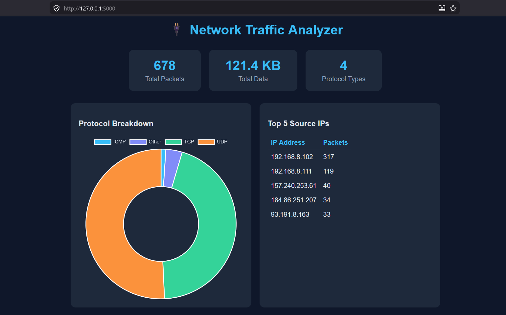

# 🔌 Network Traffic Analyzer

A Python-based tool that parses real network capture files (.pcap/.pcapng) and displays traffic insights in an interactive web dashboard.

Built as a practical application of networking knowledge from Telecommunication Technologies and Data Transmission Engineering studies at Riga Technical University.

## 📊 Features

- Parses real `.pcap` / `.pcapng` network capture files
- Stores packet data in a local SQLite database
- Web dashboard showing:
  - Total packets and data transferred
  - Protocol breakdown (TCP, UDP, ICMP)
  - Top 5 source IP addresses

## 🛠️ Tech Stack

- **Python** — core logic and packet parsing
- **Scapy** — network packet analysis
- **SQLite** — local data storage
- **Flask** — web server
- **Chart.js** — data visualization

## 🚀 How to Run

**1. Clone the repository**
git clone https://github.com/rceren/network-analyzer.git
cd network-analyzer

**2. Create and activate virtual environment**
python -m venv venv
venv\Scripts\activate

**3. Install dependencies**
pip install scapy flask pandas

**4. Add your pcap file**
Place your `.pcap` or `.pcapng` file in the project folder and update the path in `parser.py`.

**5. Parse the file**
python parser.py

**6. Launch the dashboard**
python app.py

Open your browser at `http://127.0.0.1:5000`

## 📸 Screenshot

## 👩‍💻 Author

Ruveyda Ceren Gokce — [LinkedIn]https://www.linkedin.com/in/ruveyda-ceren-gokce-67519a24a/